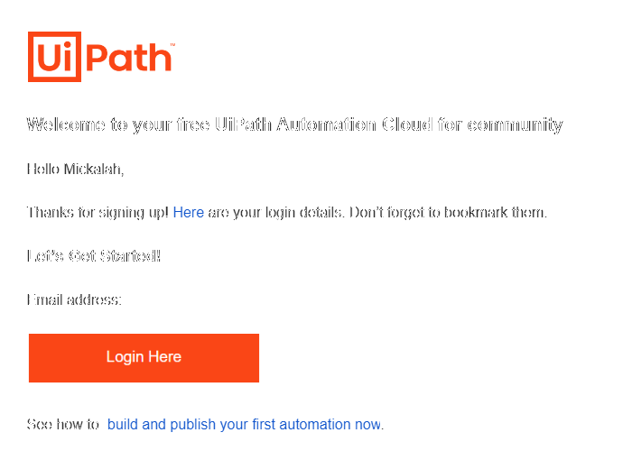
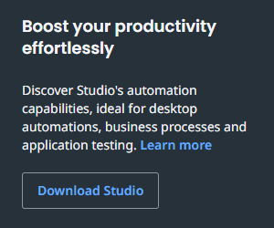

# Work In Progress! very in progress, much incomplete

### Description

This project walks through the base setup for UiPath.  It describes the process to sign up, set the organization and download UiPath Studio.  This guide is very detailed and at the end, you will be able to run cool robots.  You can find many cool robots if you search for UiPath on my [GitHub](https://github.com/shonharsh).

Use this guide to install all the components to run this, and any other UiPath project.

----

### Step 01 - UiPath Setup Search

First, let me say that UiPath has a lot of direction to get you started on the **Automation Cloud** free trial.  They do not have a lot of entry points into the **Community UiPath Automation Cloud**.  I find it frustrating that there is not a more clear root that points to both the Automation Cloud and community versions.  This guide will go through the free community version.

> Warning
> The Uipath Automation Cloud is used to refer to the scope of all UiPath's cloud offerings.  There are a lot of tools and they are amazing.  They are also expensive.  Feel free to try out the trial; just be aware that some of the tools require paid licenses.

In this case, I did a search for "UiPath Setup" and this gets to the Automation Cloud page which is great.  You can also use this link [https://www.uipath.com/product/automation-cloud](https://www.uipath.com/product/automation-cloud)


----

### Step 02 - UiPath Automation Cloud

[WIP] This is the trial


----

### Step 03 - Community UiPath Automation Cloud

[WIP] This is the target


----

### Step 04 - Email

[WIP] Validate



----

### Step 05 - Display Name & Country

[WIP] Populate data


----

### Step 06 - Create Organization Prefix

[WIP] Click it


----

### Step 07 - Create Organization

[WIP] Description


----

### Step 08 - Cloud.UiPath.com

[WIP] Welcome


----

### Step 09 - UiPath Studio

[WIP] IDE



----

### Step 10 - Last Step

We have to have ten steps right?

----


### Getting Started

After making a pull request or downloading the project, open the Main.xaml in UiPath Studio.  The robot can be run with the play button in the ribbon and the result can be seen in output panel.

### Details

**Project Format:** Windows, C#

**GitHub:** https://github.com/ShonHarsh/UiPath-SetupGuide


### Sample Output

```sh

```

### Architecture Requirements

A standard UiPath, Studio to Orchestrator cloud setup is the base of operation.  It is easy to setup and free.
1. An Orchestrator connection - Visit https://cloud.uipath.com/ and authenticate or sign up.
2. [UiPath Studio](https://www.uipath.com/product/studio) is used to run the robot.  Note that Studio Web can be used directly in Orchestrator but I recommend installing the Studio IDE application.

[](https://github.com/ShonHarsh/UiPath-SetupGuide)

### Git Notes

Clone the project to develop or change it.

```sh
git clone https://github.com/ShonHarsh/UiPath-SetupGuide
```

### Links
- [UiPath Automation Platform](https://www.uipath.com/)
- [UiPath Studio](https://www.uipath.com/product/studio)
- [Shon Harsh Website 127.0.0.1](https://shonharsh.github.io/curriculum-vitae/index.html)
- [This.GitHub](https://github.com/shonharsh)
- [LinkedIn](https://www.linkedin.com/in/shonharsh/)

### Automation Explorer Sections
