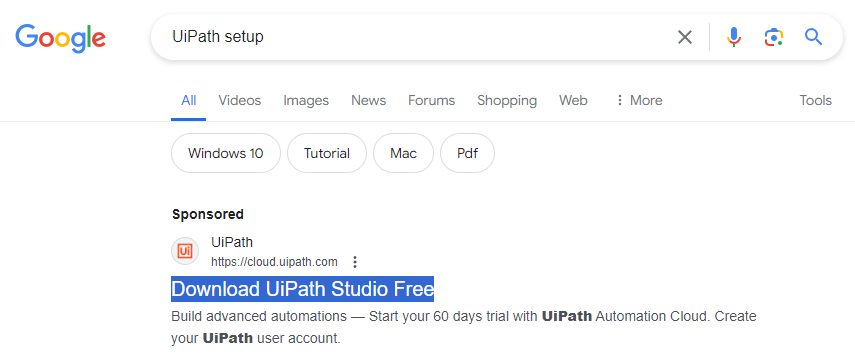
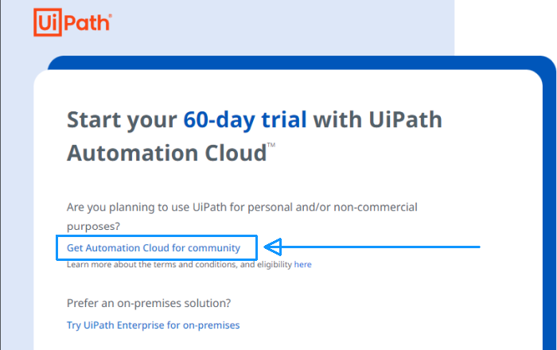
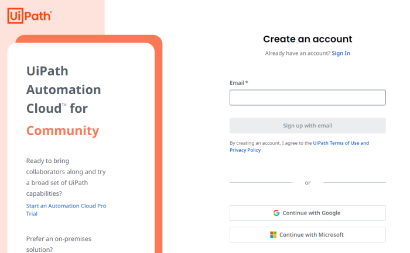
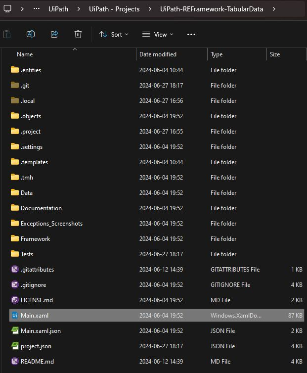

### Description

This project walks through the base setup for UiPath.  It describes the process to sign up, set the organization and download UiPath Studio.  This guide is very detailed and at the end, you will be able to run cool robots!  You can find many robots if you search for UiPath on my [GitHub](https://github.com/shonharsh).

Some recommendations are:
1. [Studio First Run](https://github.com/ShonHarsh/UiPath-AE-S01P01-StudioFirstRun) - This is a simple bot that is a good start.   Also it is the Hello, World! tradition.

2. [Fix My Workflow](https://github.com/ShonHarsh/RPADev-S07P03-FixMyWorkflow) - Fork or download this repository if you want to see a browser automation using IMDB.  It shows how easily you can scrape data and interact with applications.

3. [Replaceing Placeholders](https://github.com/ShonHarsh/RPADev-S03P06-ReplacingPlaceholders) - Replacing data can be very helpful.  This robot is an example to get you started.

4. [Extract Email Address With RegEx](https://github.com/ShonHarsh/RPADev-S03P08-ExtractEmailAddressRegEx) - Extract an email address from content with RegEx.

5. [State Machine](https://github.com/ShonHarsh/RPADev-S07P02-StateMachines) - A state machine is a type of project and this is a vending machine robot.

6. [Startup Programs](https://github.com/ShonHarsh/UiPath-Program-Start-Up-Bot) - A method to start applications on your computer.

7. [REFramework Tabular Data](https://github.com/ShonHarsh/UiPath-REFramework-TabularData) - While this is a more complex project, if you need to use a non-queue format of the REFramework, this robot will be very helpful.

----

## Use this guide to install all the components to run any UiPath project.

### Step 01 - UiPath Setup Search

First, let me say that UiPath has a lot of direction to get you started on the **Automation Cloud** free trial.  They do not have a lot of entry points into the **Community UiPath Automation Cloud**.  I find it frustrating that there is not a more clear root that points to both the Automation Cloud and community versions.  This guide will go through the **free** community version.

> [!WARNING]  
> The Uipath Automation Cloud is used to refer to the scope of all UiPath's cloud offerings.  There are a lot of tools and they are amazing.  They are also expensive.  Feel free to try out the trial; just be aware that some of the tools require paid licenses.

In this case, I did a search for "UiPath Setup" and this gets to the Automation Cloud page which is great.  You can also use this link [https://www.uipath.com/product/automation-cloud](https://www.uipath.com/product/automation-cloud)



----

### Step 02 - UiPath Automation Cloud

As mentioned, this is the Automation Cloud step.  Look for the "Get Automation Cloud for community" link.



----

### Step 03 - Community UiPath Automation Cloud

Once on the community page, enter your email or use one of the SSO options to sign up.



----

### Step 04 - Email

Next, check your email, validate the account, and then login.


----

### Step 05 - Display Name & Country

The setup is nearly complete.  Enter a display name and the country you are in.


----

### Step 06 - Create Organization Prefix

An organization is like a top level company name.  It is used to create the URL for your cloud space.  It is possible to change this name later.  Click the button to proceed.


----

### Step 07 - Create Organization

Enter your organization name.  Take note of your URL as it will be needed in the setup of UiPath Studio. Sample: `https://cloud.uipath.com/<TheNameYouEnter>`


----

### Step 08 - Cloud.UiPath.com

Welcome to the cloud!  The top left of the page will look like this image.  Before you take a look around, go to the next step to get Studio downloading.


----

### Step 09 - UiPath Studio

Click the button to download Studio.  This is UiPath's integrated development environment.  When installing Studio there will be a prompt for the organization URL.


----

### Step 10 - Open & Run!

Once installed you will be able to run the robots.  You can open a project in two ways:

1. In UiPath Studio, use the file menu to select `Open` and use the file explorer to navigate to a project on your system.
2. Open a project folder in your file system and double click on a .xaml file.  For example the Main.xaml.

The `Main.xaml` workflow is the starting point for the robots and started with the play button in the ribbon.  This runs the robot locally.  There are other ways to run robots but they are out of the scope of this guide.



----

### Getting Started

After making a pull request or downloading the project, open the Main.xaml in UiPath Studio.  The robot can be run with the play button in the ribbon and the result can be seen in output panel.

### Details

**Project Format:** Windows, C#

**GitHub:** https://github.com/ShonHarsh/UiPath-SetupGuide

### Architecture Requirements

A standard UiPath, Studio to Orchestrator cloud setup is the base of operation.  It is easy to setup and free.
1. An Orchestrator connection - Visit https://cloud.uipath.com/ and authenticate or sign up.
2. [UiPath Studio](https://www.uipath.com/product/studio) is used to run the robot.  Note that Studio Web can be used directly in Orchestrator but I recommend installing the Studio IDE application.

[](https://github.com/ShonHarsh/UiPath-SetupGuide)

### Git Notes

Clone the project to develop or change it.

```sh
git clone https://github.com/ShonHarsh/UiPath-SetupGuide
```

### Links
- [UiPath Automation Platform](https://www.uipath.com/)
- [UiPath Studio](https://www.uipath.com/product/studio)
- [Shon Harsh Website 127.0.0.1](https://shonharsh.github.io/curriculum-vitae/index.html)
- [This.GitHub](https://github.com/shonharsh)
- [LinkedIn](https://www.linkedin.com/in/shonharsh/)

### Automation Explorer Sections
